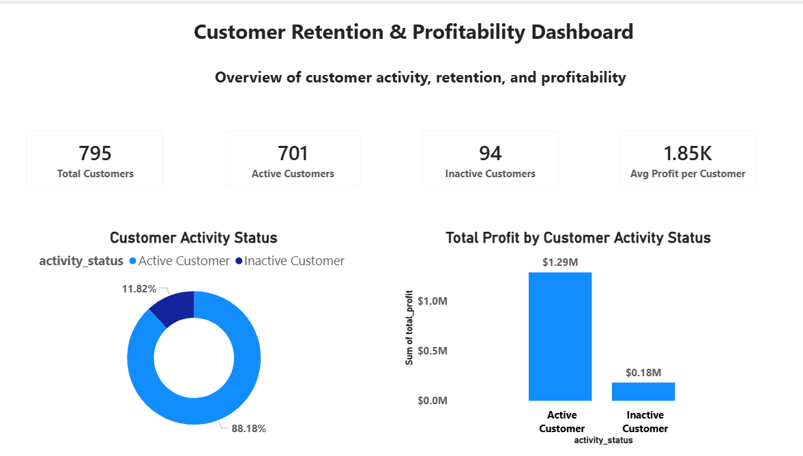
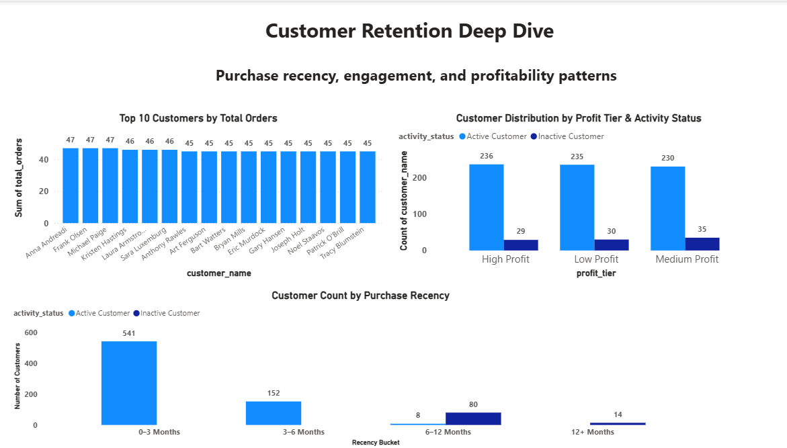
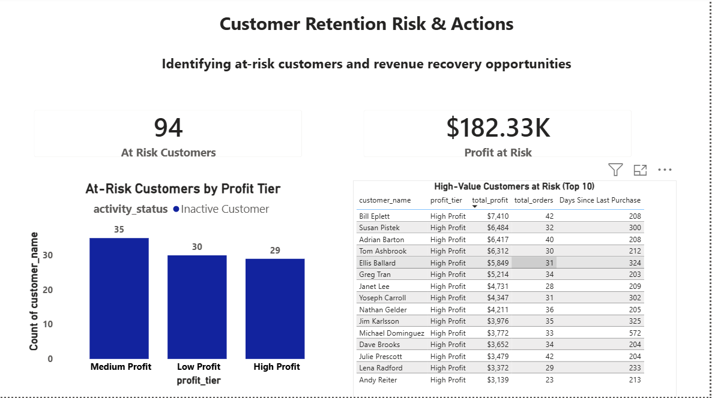

# Customer Retention & Profitability Dashboard

## Project Overview
This project analyzes customer retention behavior and profitability using transaction-level sales data.  
The goal is to identify inactive and at-risk customers, quantify revenue impact, and support data-driven retention strategies.

The analysis was performed using **Python for data preparation** and **Power BI for interactive dashboards**.

---

## Dashboard Pages

### 1️⃣ Retention Overview

**Key insights**
- Majority of customers are active, but a meaningful inactive segment exists
- Inactive customers still represent significant profit at risk
- Retention is a revenue problem, not just a volume problem

---

### 2️⃣ Customer Retention Deep Dive

**Key insights**
- Customer engagement varies widely by order frequency
- Inactive customers exist across all profit tiers
- Purchase recency highlights clear churn risk segments

---

### 3️⃣ Retention Risk & Actions

**Key insights**
- High-profit customers are among the inactive group
- Profit at risk is concentrated in specific customer segments
- The dashboard provides a clear action list for re-engagement

---

## Tools Used
- Python (Pandas, NumPy)
- Power BI
- GitHub

---

## How to Use
1. Download the `.pbix` file
2. Open with Power BI Desktop
3. Explore interactive filters and visuals

---

## Key Business Questions Answered
- How healthy is the customer base?
- Which customers are at risk of churn?
- How much profit is currently at risk?
- Which customers should be prioritized for retention actions?

---

## Author
**[MALIK SULEMANA ALUU]**  
Junior Data Analyst
